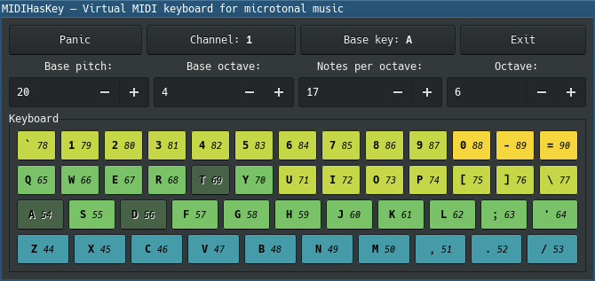

# MIDIHasKey

Virtual MIDI keyboard for microtonal music.
It works with [JACK Audio Connection Kit](http://jackaudio.org/).

One of the reason to create it is to use all keys efficiently in sense of microtonal music.
For example [Jack Keyboard](http://jack-keyboard.sourceforge.net/) trying to simulate feel of real
piano keyboard by immitating layout of white and black keys that doesn't makes any sense in
microtonal scales such as 17tet, 19tet, 22tet and any other, because these won't be devided in
equal octaves, and we have some unused keys,‥ so wasteful when we have just about 2 and half octaves
in 12tet scale and even less in other micro scales.



## WARNING!

**Work in progress! Do not expect anything for now.**

See https://github.com/metachronica/audio-midihaskey/projects/1 page that about progress of first
release.

For now you can:
* Play notes by pressing keys on keyboard you set to handle
* Play notes by pressing GUI buttons
* Trigger note-offs for everything by pressing `Panic` button

## Supported OS

* GNU/Linux

## Requirements

* [GTK3](https://www.gtk.org/)
* [JACK Audio Connection Kit](http://jackaudio.org/)  
  For included JACK MIDI player application. It's optional (if you have your own app for that)
  because for actual sending MIDI-events we have separated application so you could even write your
  own app for your favourite audio/MIDI-server, or even a writer to a file.  
  **TODO** For me: document an API for MIDI player. For now you can reverse-engeneer it looking
  inside [this file](./midiplayer/src/main.c++).
* [GCC](https://gcc.gnu.org/) __>=6.4.*__ (maybe lower, but must support C++17)  
  To build MIDI players (so it's optional too if you use your own one).

## Usage (from build to run)

### Using [Stack](https://haskellstack.org)

```bash
stack build --install-ghc
(cd midiplayer && make)
env PATH="midiplayer/build:$PATH" stack exec midihaskey -- /dev/input/by-id/usb-xxxx_yyyy-event-kbd
```

### Using [Nix](https://nixos.org/nix/)

**TODO** Implement Nix packaging for C++ MIDI player

```bash
nix-shell --pure --run 'midihaskey /dev/input/by-id/usb-xxxx_yyyy-event-kbd'
```

Where `/dev/input/by-id/usb-xxxx_yyyy-event-kbd` is your keyboard device path.

## More info

Real-time critical part (see [midiplayer](./midiplayer)) written in C++ because Haskell runtime with
[jack](http://hackage.haskell.org/package/jack) package produces a lot of XRUNs, especially when
"Panic" is triggered (it triggers 2048 MIDI events). I've tried to optimize that by avoiding lists,
using `IOArray`s (only for "Panic") and `IORef`s but it haven't helped. MIDI events still generated
and constructed in Haskell code, this C++ part just absorbs events as byte-code from stdin, puts
them to queue and then triggers them in process callback, this works perfect.

# Author

Viacheslav Lotsmanov

# License

[GNU/GPLv3](./LICENSE)
